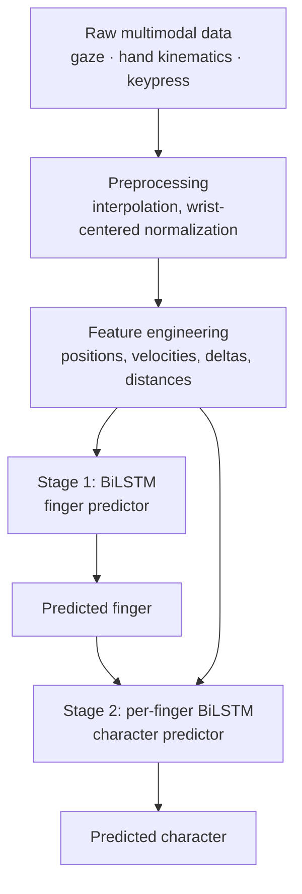

# Improved Gaze-Typing Prediction Pipeline

A two-stage deep learning pipeline that predicts typed characters from synchronized eye-gaze and hand-tracking data. The model first infers which finger executed a keypress, then uses that inference as an architectural prior to constrain a per-finger character classifier. Evaluated with leave-one-subject-out cross-validation across 5 participants.

## Why two stages?

A direct gaze-and-hand → character classifier has to discriminate between 26 outputs from a single noisy multimodal signal. The first-stage finger prediction narrows the per-finger output space to the 3–6 keys typically struck by that finger, which gives the second-stage classifier a substantially smaller and more tractable problem. Stage 1 is therefore acting as a learned **architectural prior** — not a separate downstream task, but a constraint that conditions character classification.

## Architecture



**Stage 1 — Finger predictor.** Input: normalized fingertip and wrist positions, wrist velocity, temporal delta features. Output: inferred press-finger. Architecture: `Masking → BiLSTM(128, return_sequences=True) → Dropout(0.2) → BiLSTM(64) → Dropout(0.2) → Dense(softmax)`.

**Stage 2 — Character predictor.** One per-finger model. Input: normalized hand kinematics + gaze-to-key distances + finger-to-key distances + temporal deltas + wrist velocity. Same BiLSTM architecture as Stage 1, with the output space narrowed to the keys observed for that finger cluster.

## Feature engineering

| Feature group | Description |
|---|---|
| Wrist-centered normalization | All 3D positions re-centered each frame on the average of the two wrist roots, removing absolute hand position from the signal |
| Temporal deltas | Frame-to-frame differences for each kinematic feature |
| Wrist velocity | Magnitude of wrist movement per frame |
| Gaze-to-key distance | Euclidean distance from current gaze hit to each key center |
| Finger-to-key distance | Distance from each fingertip to each key center |

## Evaluation protocol

**Leave-one-subject-out cross-validation** across 5 participants. For each fold, four participants form the training set and the held-out participant is the test set. This measures *cross-user generalization* — how the model performs on a typist it has never seen — rather than within-user performance, which is the more relevant metric for any deployed system targeting new users.

Per-fold class weights handle imbalance; early stopping on validation loss (patience 5) prevents overfitting on smaller folds.

## Results

**Stage 1 — Finger prediction (LOOCV across 5 participants):** **84.21%** average accuracy.

**Stage 2 — Character prediction per inferred finger cluster (LOOCV):**

| Finger cluster | Accuracy |
|---|---|
| Finger 1 | 71.53% |
| Finger 2 | 65.29% |
| ... | _(remaining clusters: see classification reports printed by the script)_ |

> A confusion matrix and per-finger accuracy plot will be added to `figures/` in a future commit.

## Repository structure

```
improved-gaze-typing-prediction/
├── improved_gaze_typing_prediction_pipeline.py   # full two-stage pipeline
├── requirements.txt
├── LICENSE                                        # MIT
└── README.md
```

## Installation

```bash
git clone https://github.com/mehrtam/improved-gaze-typing-prediction.git
cd improved-gaze-typing-prediction
pip install -r requirements.txt

# RAR extraction tool (Linux / Colab)
sudo apt-get install unrar -y
```

## Data format

Per-participant `.rar` archives containing `.csv` logs. Each CSV must include:

- **Gaze:** `LeftGazeHit`, `LeftGazeHitPosition_X/Y/Z`, `RightGazeHit`, `RightGazeHitPosition_X/Y/Z`
- **Hand kinematics:** `Left_Hand_<Joint>_X/Y/Z`, `Right_Hand_<Joint>_X/Y/Z` for joints including `WristRoot`, `IndexTip`, `ThumbTip`, and other tracked joints
- **Keyboard layout:** `Key_<Letter>_X/Y/Z` for each key
- **Keypress:** `PressedLetter`, `CurrentLetter`, `Phrase`, `ParticipantID`, `TrialNumber`, `LetterIndex`, `ms` (timestamp)

## Running the pipeline

```python
from improved_gaze_typing_prediction_pipeline import (
    extract_rar_files, load_and_preprocess_data, run_loocv_evaluation
)

# 1. Extract per-participant archives
extract_rar_files(rar_files, base_extract_dir="/path/to/extracted_participants")

# 2. Load CSVs and run feature engineering
df = load_and_preprocess_data("/path/to/extracted_participants")

# 3. Stage 1 — Finger prediction
run_loocv_evaluation(df, stage1_features, "InferredPressedFinger", "Stage 1")

# 4. Stage 2 — Character prediction (one model per inferred finger)
for finger_id in df["InferredPressedFinger"].unique():
    run_loocv_evaluation(
        df[df["InferredPressedFinger"] == finger_id],
        stage2_features, "PressedLetter", f"Stage 2: Finger {finger_id}"
    )
```

The script prints fold-level accuracy and full classification reports for both stages.

## Tech stack

Python · TensorFlow / Keras (Bidirectional LSTM with masking) · scikit-learn (LOOCV, metrics, label encoding) · pandas · NumPy · rarfile

## Applications

Multimodal text entry · accessibility input methods · AR/VR text-input optimization · cognitive and HCI research on gaze–motor coordination during typing.

## Citation

If you build on this work, please reference:

> Eslami, F. (2025). *Improved Gaze-Typing Prediction with Two-Stage BiLSTMs and LOOCV* [Computer software]. https://github.com/mehrtam/improved-gaze-typing-prediction

## Contact

**Fateme (Mehrta) Eslami** — University of Birmingham
[GitHub](https://github.com/mehrtam) · [LinkedIn](https://www.linkedin.com/in/fateme-eslami-014179219/)

## License

MIT — see [LICENSE](LICENSE).
